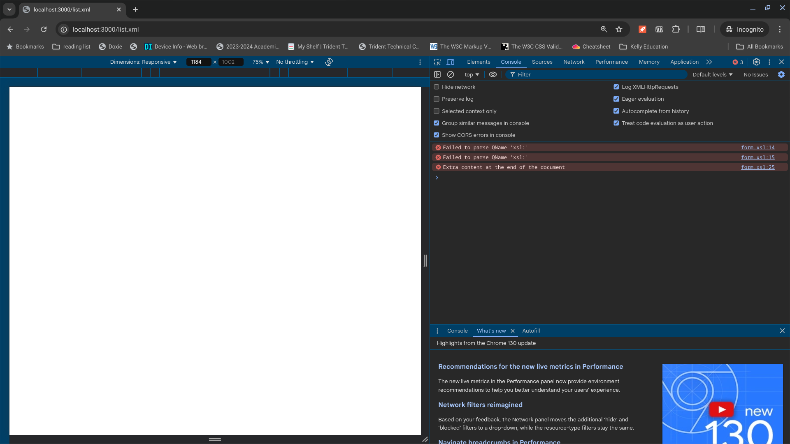
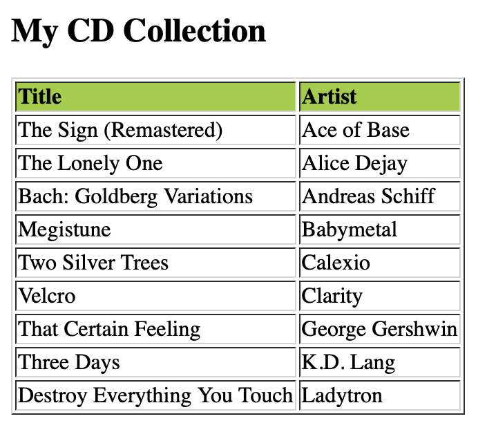

# Solution

*Interviewee's note: This document is not thoroughly edited (spelling, grammar and lots and lots of 
of informal tone and, hopefully, minimal technical inaccuracy). Were this for a much broader 
audience, e.g. students viewing an online course, I would most certainly give this the white glove
treatment.*

There is a JavaScript-based solution for transforming XML-formatted data to HTML markup,
using XSLT (eXtensible Stylesheet Language Transformation). In fact, it is well-documented on 
[w3schools.com](https://www.w3schools.com/xml/xsl_client.asp). (By the way, I literally
was not aware that modern browsers had this capability *built in*. Or, I just plumb forgot 
because I have not done it in so long<sup>1</sup>.)

In any case, all that is required for the XSLT stylesheet to take effect is to simply reference
it from the XML document we want rendered differently.

## JavaScript (for the browser).

Adding the following to the **list.xml** file near the top of the document:

```
<?xml-stylesheet type="text/xsl" href="form.xsl"?>
```

and then serving up these files from the current working directory with a web server<sup>2</sup>, e.g.

```
npx serve 
```

and we can observe (I'm using Chrome.)



...nothing!

### Bug fixing

The built-in browser console says there are issues with the stylesheet, itself. (And the 
interviewee stops and goes to work.)

To be thorough, I had to convince myself the the xml document was also well-formed. I am 
not fond of eyeballing XML markup for syntax (and, also I am lazy) so I relied on any 
existing tools that could provide that service for me: [Codebeautify.org](https://codebeautify.org/xml-parser-online)
has an XML parser that will also validate a document. Niiiiice.


Now that we are certain that we have a valid XML document, we can proceed with fixing up the XSL stylesheet. 
For reference, here is the provided bitmap image of the desired output:



#### XSLT fixes

1. Error at line 14. So clearly this part of the solution is left intentionally incomplete,
as a prompt for the interviewee to get to work. The surrounding HTML markup e.g.

```
	<xsl:form-each select="catalog/cd">
	<tr>
	  <td><xsl: /></td>
	  <td><xsl: /></td>
	</tr>
	</xsl:form-each>
```

implies that we want to extract just the title and artist portion of the **cd** element. Or,
said differently, the first two children of that element. There is probably more than one way
to specify this as an XSLT pattern match, but I'm going with an xpath<sup>3</sup> pattern that
calls out each element by name. Line 12 handily provides a working example of a pattern-match that, 
hopefully, I can customize for the purpose of rendering the **title** information.

Additional explanation: After some troubleshooting of the pattern-match rule to achieve the 
foregoing, I am reminded that the rules are *relative* to the "parent" rule that got the parser to
this point of the XML document.

```
title
```

is where we need to pick up from rule **catalog/cd**.

Further, the w3cschools article says I need the XSL **value-of** rule to extract the **title** so giving 
this a shot and refreshing the page, the console no longer reports an error at line 14. Hey, that worked out!

Moving on to Line 15, the error appears to require the same solution, so:

```
artist
```

in combination with **value-of** and this error also goes away when refreshing the page. 
Almost there.

Line 25 has a complaint about some extra content at the end of the document?? Taking a closer
look -- *oh*. Instructions for the interviewee. The sample output does not specify that this 
"extra" content be visible in the rendering, so I am simply removing it altogether (from lines
23+).

Refreshing the browser once more, all of the console errors are gone but the **h2** title does
not read precisely as specified, so that's a small addendum to the markup.

Oh wait. My rows of data are not rendering. Looks like **form-each** is a typo and should 
actually be **for-each**. HOPEFULLY, that's all that's left, e.g. corrected on Line 12:

```
	<xsl:for-each select="catalog/cd">
```

and doing similar for line 17 (for the closing tag). Refresh the browser aaaaand:


Oila!<sup>4</sup>

### More

The solution obviously has to be executed using the web browser's built-in capability. I like this 
feature because it is very accessible and makes for fast prototyping. And, I think, for 
modest implementations this is likely all that is required. However, some additional thoughts
come to mind and make me pause:

* Will the browser cache the transformation result, or does it really re-execute the stylesheet
upon every request?
* If a transformation were to be applied to a sufficiently large and/or complex document, might there 
be an observable *delay* while the browser renders the result? If such an observation were made, I
would consider an equivalent server-side solution.

Some additional thoughts on the XSL file itself:

* Externalize the CSS, which would be particularly helpful for a sufficiently complex set of rules, to
help de-clutter the HTML document.
* In a more extreme, hypothetical problem where the XML data itself were not a static file, I would 
consider a server-side solution that further separates concerns: dynamic generation of XML (e.g. as a 
result of a database query or, perhaps, as a result of an external EDI process), separate from XSLT transformation. 
Even the XSLT rule could, conceivably, be dynamically generated based on conditions found in the resultant XML.
* XML files make me nervous and I confess to the inclination to run each document through a validator. Human error prevails, in spite of our best effort oft-times.
* I did discover a third party option for transformation of XML: [Saxonica](https://www.saxonica.com/html/download/download_page.html) 
supports browser, and several programming language bindings. Are there yet more offerings, from other vendors? Absolutely.

## Java

Time permitting, I would like to take a crack at an equivalent solution written in Java.

## C++

Same for C++.

-----------------------------------

<sup>1</sup> [This Stack Overflow article](http://stackoverflow.com/questions/3466854/ddg#3466912) 
says the feature became available from all major web browsers in 2010.

<sup>2</sup> I use NodeJS and many supporting tools e.g. *npx*

<sup>3</sup> Boy, I hope I am using this terminology correctly. It's late; I'm in a rush.

<sup>4</sup> Compliments on the selection of 90s music!
